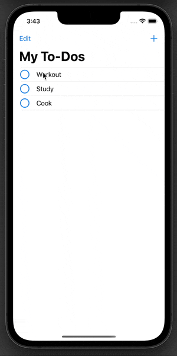

# ToDo List App
This app is a simple to-do list app that allows the user to enter an event or item including: title, date, and notes. 

The app incorporates...
- Persistence that allows for items to be saved as well as updated
- Simple UI/UX
- Custom delegation that notifies the to-do controller when a cell has been checked completed
<details> 
<summary> Code </summary>


``` Swift 
import UIKit

// 1. Write protocol in the ToDoCell
protocol ToDoCellDelegate: AnyObject {
    func checkMarkTapped(sender: ToDoCell)
}

class ToDoCell: UITableViewCell {
    
    @IBOutlet weak var isCompleteButton: UIButton!
    @IBOutlet weak var titleLabel: UILabel!
    
    // 2. Declare a property that will be a weak reference to the delegate object
    weak var delegate: ToDoCellDelegate?

    // 3. Use the delegate instance wherever you need to notify the delegate object of a change.
    @IBAction func completeButtonPressed(_ sender: UIButton) {
        delegate?.checkMarkTapped(sender: self)
    }
}
```

``` Swift 
  override func tableView(_ tableView: UITableView, cellForRowAt indexPath: IndexPath) -> UITableViewCell {
      // 4. get a reference to the object we will need notification from, here it is an instance of the ToDoCell
        guard let cell = tableView.dequeueReusableCell(withIdentifier: "toDoCell", for: indexPath) as? ToDoCell else {
            fatalError("Could not dequeue a TableViewCell")
        }
        // 5. set the delegate property, here we are setting self (ToDoTableView)
        cell.delegate = self
        let toDo = toDos[indexPath.row]
        cell.titleLabel.text = toDo.title
        cell.isCompleteButton.isSelected = toDo.isComplete
        return cell
    }

```
``` Swift
// 6. conform to the ToDoCellDelegate protocol and implement any required methods, properties or initializers
    func checkMarkTapped(sender: ToDoCell) {
        if let indexPath = tableView.indexPath(for: sender) {
            var toDo = toDos[indexPath.row]
            toDo.isComplete.toggle()
            toDos[indexPath.row] = toDo
            tableView.reloadRows(at: [indexPath], with: .automatic)
            ToDo.saveToDos(toDos)
        }
    }


```

</details>

### GIF


